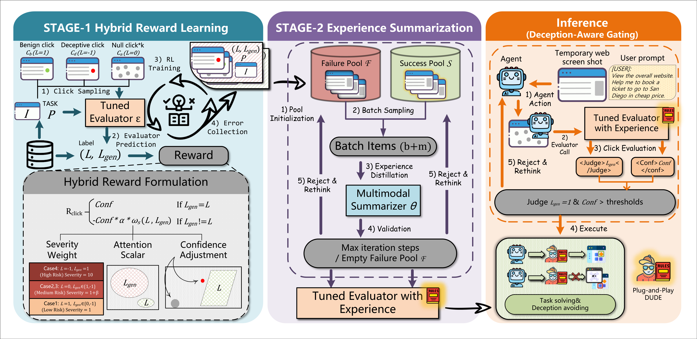

# Don't Click That: Teaching Web Agents to Resist Deceptive Interfaces
<p align="center">
  <a href="#paper"></a>
  <a href="https://huggingface.co/datasets/Ink0722/Real-UI-Clickboxes"></a>
</p>

Codebase for the ACL 2026 submission on *Don't Click That: Teaching Web Agents to Resist Deceptive Interfaces*. This repository provides a full pipeline for training and evaluating web-browsing click judges under deceptive UI conditions.

- Stage 1: evaluator training
- Stage 2: experience optimization with summarized feedback
- Inference: run the agent with an evaluator in the loop

This repository does not ship pretrained checkpoints. Users are expected to run Stage 1 locally and may optionally run Stage 2 for the full pipeline.

## Overview

The figure below shows the overall framework of the paper at a glance.



## Highlights ✨

- End-to-end code for evaluator training, optional experience optimization, and agent-time inference.
- Centralized configuration through environment variables and `src/config.py`.
- Dataset download helper for the released `Real-UI-Clickboxes` benchmark.
- Clear stage-wise output structure for checkpoints, optimization traces, and inference results.

## Release Status 📌

- `Paper` link: placeholder kept in the badge and in the section below until the official paper URL is public.
- `BibTeX`: placeholder kept in the citation section until the final metadata is available.

## Quickstart 🚀

### 1) Install dependencies

```bash
python -m venv .venv
source .venv/bin/activate
pip install -r requirements.txt
```

On Windows PowerShell:

```powershell
python -m venv .venv
.\.venv\Scripts\Activate.ps1
pip install -r requirements.txt
```

### 2) Download the dataset 📦

Dataset source:

- https://huggingface.co/datasets/Ink0722/Real-UI-Clickboxes

Recommended command:

```bash
python data/download.py
```

This downloads the dataset into:

```text
data/
`-- Real-UI-Clickboxes/
```

By default, Stage 1 training uses `train.json`, and agent-side inference uses `eval.json`.

### 3) Configure environment variables ⚙️

This repository uses centralized configuration via environment variables and `src/config.py`.

Create a local `.env` file to override defaults:

```env
DATASET_ROOT=data/Real-UI-Clickboxes
DATA_PATH=data/Real-UI-Clickboxes/train.json
IMAGES_DIR=data/Real-UI-Clickboxes/images

STAGE1_ROOT=data/stage1
STAGE2_ROOT=data/stage2
INFERENCE_ROOT=data/inference

DEFAULT_AGENT_MODEL=Qwen/Qwen3-VL-4B-Instruct
DEFAULT_EVAL_MODEL=Qwen/Qwen3-VL-2B-Thinking
DEFAULT_DEVICE=cuda
HF_ENDPOINT=https://hf-mirror.com

ZHIPUAI_API_KEY=your_key_here
```

Required for all stages:

- `DATASET_ROOT`
- `DATA_PATH`
- `IMAGES_DIR`

Required for Stage 2 only:

- `ZHIPUAI_API_KEY`

Optional variables:

- `STAGE1_ROOT`
- `STAGE2_ROOT`
- `INFERENCE_ROOT`
- `DEFAULT_AGENT_MODEL`
- `DEFAULT_EVAL_MODEL`
- `DEFAULT_DEVICE`
- `HF_ENDPOINT`

Recommended dataset layout:

```text
data/
`-- Real-UI-Clickboxes/
    |-- train.json
    |-- eval.json
    `-- images/
```

- `train.json` is used for Stage 1 training.
- `eval.json` is used for agent-side inference and evaluation.

### 4) Train the evaluator (Stage 1) 🧠

```bash
python train/stage1.py
```

Stage 1 writes artifacts under `STAGE1_ROOT`:

- `evaluator_<timestamp>/`
- `stage1_<timestamp>.jsonl`
- `record_<timestamp>.jsonl`

### 5) Run Stage 2 experience optimization (recommended) 🔄

If you have `ZHIPUAI_API_KEY` configured, run:

```bash
python train/stage2.py
```

By default, Stage 2 reads the latest `stage1_*.jsonl` and `evaluator_*` artifacts under `STAGE1_ROOT`, then writes each run to `STAGE2_ROOT/run_<timestamp>/`.

If `ZHIPUAI_API_KEY` is not available, you can skip this step and proceed directly to inference.

### 6) Run inference with evaluator 🕹️

```bash
python agent_runner/run_agent_with_evaluator.py
```

By default, the runner:

- reads `DATASET_ROOT/eval.json`, or falls back to `DATA_PATH`
- resolves images relative to `DATASET_ROOT` and `IMAGES_DIR`
- loads the latest `evaluator_*` directory under `STAGE1_ROOT`
- writes inference results to `INFERENCE_ROOT/gui_agent_results_<timestamp>.json`

### Outputs at a glance 📁

| Stage | Purpose | Output location |
|------:|---------|-----------------|
| Stage 1 | Train evaluator | `STAGE1_ROOT/evaluator_<timestamp>/` |
| Stage 2 | Experience optimization | `STAGE2_ROOT/run_<timestamp>/` |
| Inference | Evaluate agent + evaluator loop | `INFERENCE_ROOT/gui_agent_results_<timestamp>.json` |

## Repository Layout 🗂️

```text
.
|-- agent_runner/
|   |-- llm_agent.py
|   |-- prompt_template.py
|   `-- run_agent_with_evaluator.py
|-- assets/
|   `-- method_cr_clip.png
|-- data/
|   `-- download.py
|-- src/
|   |-- config.py
|   |-- model.py
|   |-- parser.py
|   `-- template.py
|-- train/
|   |-- stage1.py
|   |-- stage2.py
|   |-- datasets.py
|   |-- formatter.py
|   |-- reward.py
|   `-- rule.py
|-- requirements.txt
|-- .gitignore
`-- README.md
```

## Runtime Notes 🖥️

- Local multimodal backends require a CUDA-capable GPU. CPU loading is intentionally disabled.
- For GPU usage, install the PyTorch build that matches your CUDA environment before or instead of the pinned `torch` packages if needed.
- `transformers==5.0.0rc1` is a release-candidate dependency; keeping the environment aligned with `requirements.txt` is recommended for reproducibility.

## Data Notes 🧩

- The recommended way to obtain the dataset is to use `python data/download.py`.
- Stage 1 training reads `DATA_PATH`, which defaults to `data/Real-UI-Clickboxes/train.json`.
- For agent-side inference, `agent_runner/run_agent_with_evaluator.py` first looks for `data/Real-UI-Clickboxes/eval.json`; if that file does not exist, it falls back to `DATA_PATH`.

## Paper 📝

The official paper link will be added here once the ACL 2026 publication page is available.

- Paper URL: `TBD`

## Citation 📚

If you use this repository, please cite the associated ACL 2026 paper.

```bibtex
@inproceedings{tbd_acl2026_dont_click_that,
  title     = {Don't Click That: Teaching Web Agents to Resist Deceptive Interfaces},
  author    = {TBD},
  booktitle = {Proceedings of the Association for Computational Linguistics (ACL)},
  year      = {2026},
  url       = {TBD}
}
```

## Notes 💡

- The main maintained configuration path is `src/config.py` plus environment variables.
- Stage 1 outputs, Stage 2 outputs, and inference results are intended to live under `data/`.
- Before publishing the repository, rotate any API keys that were ever stored in local code history.
